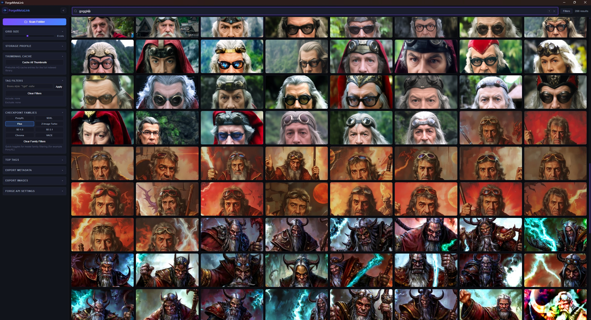

<div align="center">
  <h1>ForgeMetaLink</h1>
  <p><strong>Desktop gallery + metadata manager for large AI image libraries.</strong></p>
  <p>Scan folders, search instantly, curate safely, export cleanly, and send images back to Forge.</p>
  
</div>

ForgeMetaLink is built with React + TypeScript + Tauri + Rust and stores runtime data locally in SQLite.

## Start Here (New Users)

### 1) Install

Download the latest release:

- https://github.com/soficis/forge-meta-link/releases

Typical assets:

- Windows x64: `forge-meta-link_<version>_x64-setup.exe` (or `.msi`)
- Windows ARM64: `forge-meta-link_<version>_arm64-setup.exe` (or `.msi`)
- Linux x64: `forge-meta-link_<version>_amd64.deb` or `forge-meta-link_<version>_amd64.AppImage`

### 2) First-run flow (5 minutes)

1. Click **Scan Folder** and choose your AI image directory.
2. Set **Storage Profile** to `HDD` or `SSD` (match your actual drive).
3. Wait for scan stages (`scanning` → `indexing` → `thumbnails`).
4. Use search + filters (model, LoRA, generation type, checkpoint family).
5. Multi-select a few images and try **Favorite**, **Lock**, and **Move Selected**.
6. Keep delete mode on **Move to Recycle Bin/Trash** while learning.
7. Open an image in the viewer, inspect metadata, and try export or Forge send.

---

## Highlighted Features (with real use cases)

- **Fast search + filter stack**  
  _Use case:_ “Find all Flux outputs with a specific LoRA from last week.”

- **Safe deletion workflow (Trash/permanent + Undo + protection)**  
  _Use case:_ “Clean 500 test renders without accidentally deleting favorites.”

- **Bulk curation tools (favorite/lock/move selected)**  
  _Use case:_ “Move all approved images into a final delivery folder in one action.”

- **Viewer built for review sessions (zoom/pan/filmstrip/slideshow)**  
  _Use case:_ “Rapidly review variations and compare details at 100% zoom.”

- **Forge round-trip controls**  
  _Use case:_ “Open a previous image, tweak settings, resend directly to Forge.”

- **Metadata + image export**  
  _Use case:_ “Export a selected set as CSV + WebP ZIP for downstream workflow.”

---

## Troubleshooting (First-Time Users)

### Asset protocol errors

If logs show:
`[ERROR tauri::protocol::asset] asset protocol not configured to allow the path ...`

Try this:

- Rescan the folder from inside ForgeMetaLink after selecting the exact drive/folder.
- Use normal local drive paths (for Windows, prefer mapped drive letters over unsupported network path forms).
- Confirm files still exist and are readable by your OS account.
- Restart the app after drive/mount-letter changes.

### Blank images in gallery/viewer

- Wait a moment: thumbnails and full-res images load progressively.
- If a thumbnail is blank, open another image then return (forces reload path checks).
- Use **Cache All Thumbnails** for large libraries to reduce on-demand delays.
- If only specific files fail, validate they are not corrupted.

### Stale thumbnails (old preview after file changes)

- Rescan the same folder.
- Run **Cache All Thumbnails**.
- If still stale, close app, clear thumbnail cache in app data (`thumbnails/`), reopen, and rescan.

---

## Forge Quick Setup

1. Start Forge with API enabled (`--api`).
2. In **Forge API Settings**, set base URL (example: `http://127.0.0.1:7860`).
3. Optional: add API key.
4. Optional: set output/models/LoRA folders.
5. Click **Test Connection**.
6. Send either one image from viewer or a selected batch from sidebar.

---

## Keyboard Shortcuts

### Gallery

- `Ctrl+A` / `Cmd+A`: Select all loaded images
- `Esc`: Clear current selection
- `Delete` / `Backspace`: Run delete action on selected images (uses current delete mode)

### Viewer

- `Left` / `Right`: Previous/next image
- `+` / `=`: Zoom in
- `-`: Zoom out
- `0`: Reset zoom/pan
- `I`: Toggle info panel
- `S`: Toggle slideshow
- `Esc`: Stop slideshow or close viewer

---

## Build & Development

### Prerequisites

- Node.js 20+
- Rust stable
- Tauri OS prerequisites

Linux (Debian/Ubuntu) dependencies:

```bash
sudo apt update && sudo apt install -y \
  libglib2.0-dev libssl-dev libgtk-3-dev libwebkit2gtk-4.1-dev \
  libayatana-appindicator3-dev librsvg2-dev patchelf
```

### Run in development

```bash
npm ci
npm run tauri -- dev
```

### Build release bundles

```bash
npm run tauri -- build
```

### One-click Build Wizard (recommended)

Launch:

- `npm run build:wizard`
- `./scripts/build-wizard.sh`
- `scripts\build-wizard.cmd`
- `.\scripts\build-wizard.ps1`

Target IDs:

- `host-default`
- `linux-x64`
- `linux-arm64` (Docker/QEMU local `.deb`, untested)
- `windows-x64`
- `windows-arm64` (untested)
- `macos-x64`
- `macos-arm64`

Examples:

```bash
npm run build:wizard -- --targets=host-default --yes
npm run build:wizard -- --targets=linux-x64,windows-x64 --yes
npm run build:wizard -- --targets=linux-arm64 --yes
```

### Manual target builds

- Linux x64 (`.deb` + `.AppImage`):
  `npm run tauri -- build --bundles deb,appimage`
- Windows x64 (`.msi` + setup `.exe`):
  `npm run tauri -- build --bundles msi,nsis`
- Windows ARM64 (`.msi` + setup `.exe`):
  `npm run tauri -- build --target aarch64-pc-windows-msvc --bundles msi,nsis`

---

## Platform Status

- Windows: primary platform, most tested
- Linux: limited validation across distros/desktops
- macOS: limited validation
- ARM64 outputs (Windows/Linux): currently untested

---

## Data & Privacy

Runtime data is local in Tauri `app_data_dir`, including:

- `ForgeMetaLink.db`
- `thumbnails/`
- `storage_profile.json`
- `forge-outputs/`

Notes:

- UI preferences are stored locally in webview local storage.
- Forge URL/API key are stored locally for convenience.

---

## License

GNU General Public License v3.0 (GPLv3):
https://www.gnu.org/licenses/gpl-3.0.txt
