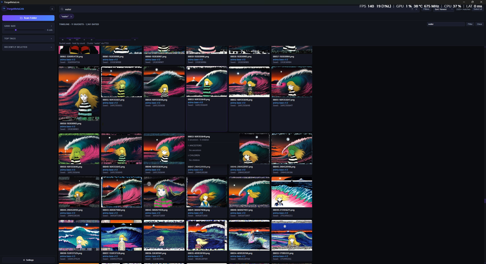

<div align="center">
  <h1>ForgeMetaLink</h1>
  <p><strong>Desktop gallery + metadata manager for large AI image libraries.</strong></p>
  <p>Scan folders, search instantly, curate safely, export cleanly, and send images back to Forge.</p>
  
</div>

ForgeMetaLink is built with React + TypeScript + Tauri + Rust and stores runtime data locally in SQLite.

## Start Here (New Users)

### 1) Install

Download the latest release:

- https://github.com/soficis/forge-meta-link/releases

Typical assets:

- Windows x64: `forge-meta-link_<version>_x64-setup.exe` (or `.msi`)
- Windows ARM64: `forge-meta-link_<version>_arm64-setup.exe` (or `.msi`)
- Linux x64 / ARM64: `forge-meta-link_<version>_amd64.deb` or `.AppImage` (ARM64 builds are untested)
- macOS (Intel and Apple Silicon): `forge-meta-link_<version>_<x64|arm64>.dmg` (not code-signed; limited validation)

Each release also lists `SHA256SUMS.txt`. To verify a download:

```bash
sha256sum -c --ignore-missing SHA256SUMS.txt
```

### 2) First-run flow (5 minutes)

1. Click **Scan Folder** and choose your AI image directory.
2. Set **Storage Profile** to `HDD` or `SSD` (match your actual drive).
3. Wait for scan stages (`scanning` → `indexing` → `thumbnails`).
4. Use search + filters (model, LoRA, generation type, checkpoint family).
5. Multi-select a few images and try **Favorite**, **Lock**, and **Move Selected**.
6. Press `Del` to move images to the Recycle Bin/Trash (you get 6 seconds to undo with `Ctrl+Z`). Permanent delete is a separate command (`Shift+Del`) and always asks first.
7. Open an image in the viewer, inspect metadata, and try export or Forge send.

---

## Highlighted Features (with real use cases)

- **Fast search + filter stack**  
  _Use case:_ “Find all Flux outputs with a specific LoRA from last week.”

- **Safe deletion workflow (Trash by default + Undo + locks)**  
  _Use case:_ “Clean 500 test renders without touching the ones I locked.”  
  Only **locked** images are protected from deletion. Favorites are just a marker unless
  _Lock images when I favorite them_ is on (Settings → Deletion safety).

- **Compare Lab**  
  _Use case:_ “Pin up to four variations side by side (keys `1`–`4`) and see which settings differ.”

- **Lineage (experimental)**  
  _Use case:_ “Trace an image’s generation history back to earlier iterations.”  
  Exact-seed parent links are inferred automatically and shown on hover mini-graphs and in Compare Lab. You can re-run inference at any time via **Rebuild lineage** under Settings → Library (manual links and unlinks are preserved).

- **Timeline heatmap + date filter**  
  _Use case:_ “Jump to everything I generated on a specific day.”

- **Duplicate finder** (Settings → Library)  
  _Use case:_ “Find files that are very likely copies.” Matching uses file size plus sampled
  content, so check the files before deleting.

- **Tag sidecars**  
  _Use case:_ “Keep tags and notes in `<image>.yaml` next to the image so they travel with the file.”

- **Bulk curation tools (favorite/lock/move selected)**  
  _Use case:_ “Move all approved images into a final delivery folder in one action.”

- **Viewer built for review sessions (zoom/pan/filmstrip/slideshow)**  
  _Use case:_ “Rapidly review variations and compare details at 100% zoom.”

- **Forge round-trip controls**  
  _Use case:_ “Open a previous image, tweak settings, resend directly to Forge.”

- **Metadata + image export**  
  _Use case:_ “Export a selected set as CSV + WebP ZIP for downstream workflow.”

---

## Troubleshooting (First-Time Users)

### Asset protocol errors

If logs show:
`[ERROR tauri::protocol::asset] asset protocol not configured to allow the path ...`

Try this:

- Rescan the folder from inside ForgeMetaLink. Images outside the app data folder are only readable after their folder has been scanned (the app grants access to scanned folders, including on restart).
- Use normal local drive paths (for Windows, prefer mapped drive letters over unsupported network path forms).
- Confirm files still exist and are readable by your OS account.
- Restart the app after drive/mount-letter changes.

### Blank images in gallery/viewer

- Wait a moment: thumbnails and full-res images load progressively.
- If a thumbnail is blank, open another image then return (forces reload path checks).
- Use **Build missing thumbnails** (Settings → Library) for large libraries to reduce on-demand delays.
- If only specific files fail, validate they are not corrupted.

### Stale thumbnails (old preview after file changes)

- Rescan the same folder.
- Run **Force Rebuild All** under Settings → Library → Thumbnail cache.
- If still stale, close app, clear thumbnail cache in app data (`thumbnails/`), reopen, and rescan.

---

## Forge Quick Setup

1. Start Forge with API enabled (`--api`).
2. Open **Settings → Forge connection** and set the base URL (example: `http://127.0.0.1:7860`).
3. Optional: add API key.
4. Optional: set output/models/LoRA folders.
5. Click **Test Connection**.
6. Send either one image from viewer or a selected batch from sidebar.

---

## Keyboard Shortcuts

Press `?` in the app for the full list.

### Gallery

- `Ctrl+A` / `Cmd+A`: Select all loaded images
- Arrow keys / `Home` / `End`: Move between thumbnails
- `Enter`: Open the focused thumbnail; `Space`: select or unselect it
- `Shift+click` / `Shift+arrows`: Select a range; `Ctrl+click`: add or remove one image
- `Ctrl+F`: Focus search
- `Esc`: Clear the current selection
- `f` and `1`–`4` act on the **focused** thumbnail (or, for `f`, the selection). With nothing focused or selected they do nothing and show a hint.

### Deleting

- `Del`: Move the focused image or selection to the Recycle Bin/Trash. Selecting 25 or more images asks for confirmation first.
- `Shift+Del`: Delete permanently (always asks first).
- `Ctrl+Z` / `Cmd+Z`: Undo within 6 seconds. Nothing is removed from disk until the undo window ends.
- Locked images are never deleted.

### Viewer

- `j` / `k` or `Left` / `Right`: Next / previous image
- `f`: Toggle favorite; `1`–`4`: Pin to Compare Lab
- `Del` / `Shift+Del`: Trash / delete permanently
- `+` / `=`, `-`, `0`: Zoom in, zoom out, reset
- `i`: Toggle info panel; `s`: Toggle slideshow
- `Esc`: Stop slideshow or close viewer

---

## Build & Development

### Prerequisites

- Node.js 22 (matches CI)
- Rust stable
- Tauri OS prerequisites

Linux (Debian/Ubuntu) dependencies:

```bash
sudo apt update && sudo apt install -y \
  libglib2.0-dev libssl-dev libgtk-3-dev libwebkit2gtk-4.1-dev \
  libayatana-appindicator3-dev librsvg2-dev patchelf
```

### Run in development

```bash
npm ci
npm run tauri -- dev
```

### Build release bundles

```bash
npm run tauri -- build
```

### One-click Build Wizard (recommended)

Launch:

- `npm run build:wizard`
- `./scripts/build-wizard.sh`
- `scripts\build-wizard.cmd`
- `.\scripts\build-wizard.ps1`

Target IDs:

- `host-default`
- `linux-x64`
- `linux-arm64` (Docker/QEMU local `.deb`, untested)
- `windows-x64`
- `windows-arm64` (untested)
- `macos-x64`
- `macos-arm64`

Examples:

```bash
npm run build:wizard -- --targets=host-default --yes
npm run build:wizard -- --targets=linux-x64,windows-x64 --yes
npm run build:wizard -- --targets=linux-arm64 --yes
```

### Manual target builds

- Linux x64 (`.deb` + `.AppImage`):
  `npm run tauri -- build --bundles deb,appimage`
- Windows x64 (`.msi` + setup `.exe`):
  `npm run tauri -- build --bundles msi,nsis`
- Windows ARM64 (`.msi` + setup `.exe`):
  `npm run tauri -- build --target aarch64-pc-windows-msvc --bundles msi,nsis`

---

## Platform Status

- Windows: primary platform, most tested
- Linux: limited validation across distros/desktops
- macOS: limited validation
- ARM64 outputs (Windows/Linux): currently untested

---

## Data & Privacy

Runtime data is local in Tauri `app_data_dir`, including:

- `ForgeMetaLink.db`
- `thumbnails/`
- `storage_profile.json`
- `forge-outputs/`

Notes:

- UI preferences and the Forge URL are stored locally in webview local storage.
- The Forge API key is stored in the OS keyring (Windows Credential Manager, macOS Keychain, Secret Service). Only if the keyring is unavailable does the app fall back to a plaintext file in `app_data_dir`.
- Tag sidecars (`<image>.yaml`) are written next to your images.
- Deleting an image also removes its matching `.yaml`/`.json` sidecar (moved to the Trash in Trash mode, deleted in permanent mode), unless another indexed image in the same folder shares that file name.

---

## License

GNU General Public License v3.0 (GPLv3):
https://www.gnu.org/licenses/gpl-3.0.txt
